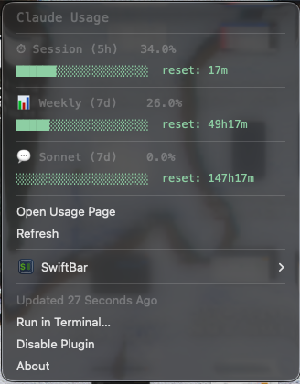

# Claude Usage SwiftBar Plugin

macOS メニューバーに Claude の使用量をリアルタイム表示する [SwiftBar](https://github.com/swiftbar/SwiftBar) プラグインです。

Claude Pro / Max プランの **5時間セッション制限** と **7日間の使用上限** をひと目で確認できます。



## 表示内容

### メニューバー

使用率に応じて色分けされたアイコンと5時間セッションの使用率を表示します。

| アイコン | 使用率 |
|---------|--------|
| 🟢 | 0 - 49% |
| 🟡 | 50 - 69% |
| 🟠 | 70 - 89% |
| 🔴 | 90 - 100% |

### ドロップダウン

メニューバーのアイコンをクリックすると、以下の詳細情報が表示されます。

| 項目 | 説明 |
|------|------|
| ⏱ Session (5h) | 現在の5時間セッションの使用率とリセットまでの残り時間 |
| 📊 Weekly (7d) | 7日間の全体使用上限に対する使用率 |
| 💬 Sonnet (7d) | 7日間の Sonnet モデル使用上限に対する使用率 |

プログレスバーで視覚的に確認でき、「Open Usage Page」から claude.ai の使用量ページに直接アクセスできます。

## 必要条件

- **macOS** 12.0 以降
- **[Claude Code](https://docs.anthropic.com/en/docs/claude-code)** がインストール済みで、ログイン済みであること
- **[Homebrew](https://brew.sh)** （SwiftBar のインストールに使用）
- **Python 3** （macOS にプリインストール済み）
- **curl** （macOS にプリインストール済み）

## インストール

### 自動インストール（推奨）

```bash
git clone https://github.com/RyoUmeyama/claude-usage-swiftbar.git
cd claude-usage-swiftbar
chmod +x install.sh
./install.sh
```

インストールスクリプトが以下を自動で行います：

1. SwiftBar がなければ Homebrew でインストール
2. プラグインを SwiftBar のプラグインディレクトリにコピー
3. SwiftBar をログイン項目に追加（Mac 再起動後も自動起動）
4. SwiftBar を起動

### 手動インストール

1. SwiftBar をインストール

```bash
brew install --cask swiftbar
```

2. プラグインをコピー

```bash
mkdir -p "$HOME/Library/Application Support/SwiftBar/Plugins"
cp claude-usage.2m.sh "$HOME/Library/Application Support/SwiftBar/Plugins/"
chmod +x "$HOME/Library/Application Support/SwiftBar/Plugins/claude-usage.2m.sh"
```

3. SwiftBar を起動し、プラグインディレクトリとして `~/Library/Application Support/SwiftBar/Plugins` を選択

## アンインストール

```bash
chmod +x uninstall.sh
./uninstall.sh
```

SwiftBar 自体も削除する場合：

```bash
brew uninstall --cask swiftbar
```

## 仕組み

1. macOS キーチェーンから Claude Code の OAuth 認証情報を取得
2. Anthropic の使用量 API (`https://api.anthropic.com/api/oauth/usage`) にリクエスト
3. レスポンスをパースしてメニューバーに表示
4. 2分ごとに自動更新

**プライバシー**: 認証情報は macOS キーチェーンから読み取るだけで、外部に送信しません。使用量データは Anthropic の公式 API から取得し、ローカルに保存しません。

## 設定のカスタマイズ

### 更新間隔の変更

ファイル名の `.2m.` 部分が更新間隔を表します。変更するにはファイル名をリネームしてください。

```bash
# 例: 5分間隔にする場合
cd "$HOME/Library/Application Support/SwiftBar/Plugins"
mv claude-usage.2m.sh claude-usage.5m.sh
```

対応する形式: `s`（秒）、`m`（分）、`h`（時間）、`d`（日）

### Claude Code へのログイン

プラグインが `☁️ --` と表示される場合、Claude Code にログインしてください。

```bash
claude /login
```

## トラブルシューティング

| 症状 | 原因 | 対処法 |
|------|------|--------|
| `☁️ --` と表示される | Claude Code にログインしていない | `claude /login` を実行 |
| メニューバーに表示されない | SwiftBar が起動していない | `open -a SwiftBar` を実行 |
| 数値が更新されない | SwiftBar のプラグインが停止している | メニューバーの SwiftBar アイコン → プラグインを右クリック → Refresh |
| claude.ai の表示と異なる | キャッシュの遅延（通常2分以内に同期） | 「Refresh」をクリック |

## 対応プラン

Claude Code の OAuth 認証を使用するため、以下のプランで動作します：

- Claude Pro
- Claude Max (5x)
- Claude Max (20x)

## ライセンス

MIT License - 詳細は [LICENSE](LICENSE) を参照してください。
